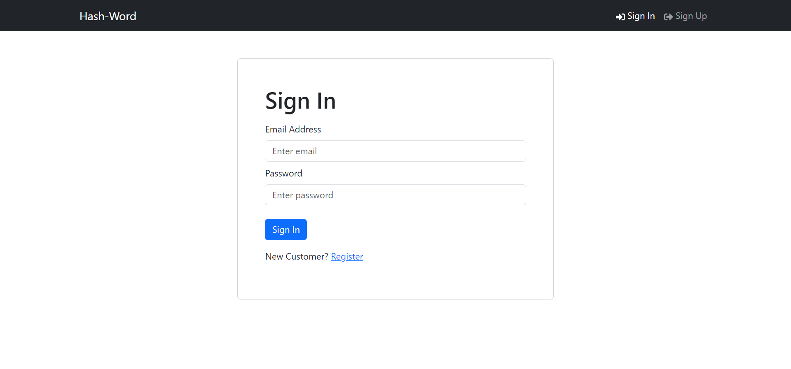
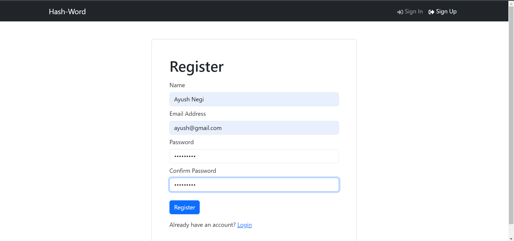
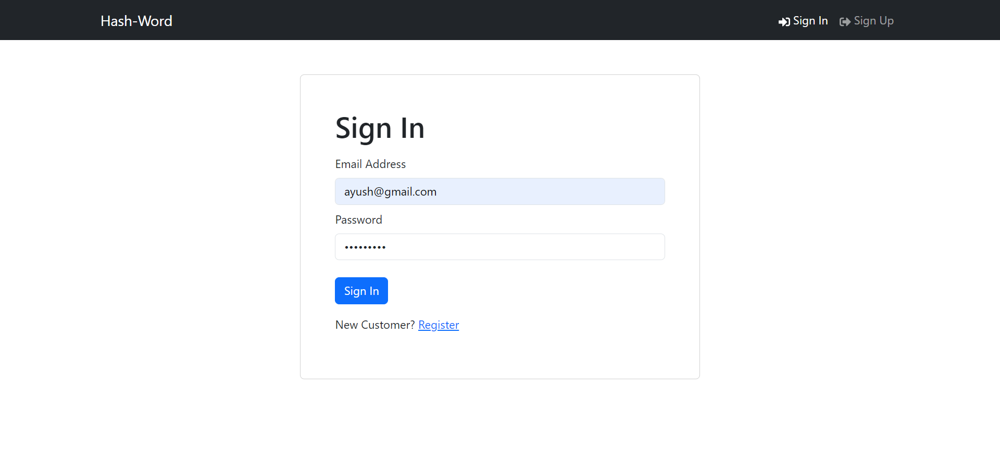
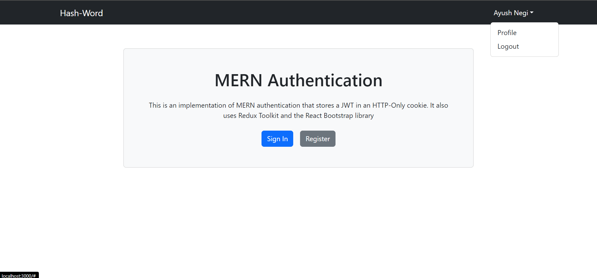
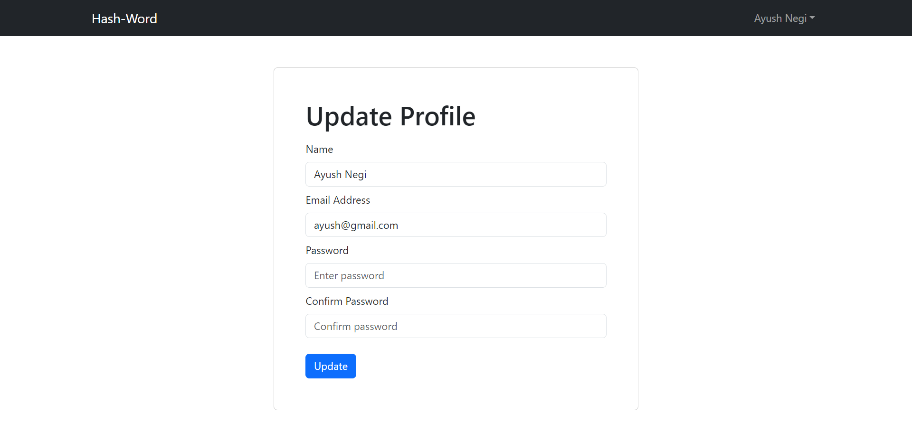

# HashWord


It includes the following:

- Backend API with Express & MongoDB
- Routes for auth, logout, register, profile, update profile
- JWT authentication stored in HTTP-only cookie
- Protected routes and endpoints
- Custom middleware to check JSON web token and store in cookie
- Custom error middleware
- React frontend to register, login, logout, view profile, and update profile
- React Bootstrap UI library
- React Toastify notifications

## Usage

- Create a MongoDB database and obtain your `MongoDB URI` - [MongoDB Atlas](https://www.mongodb.com/cloud/atlas/register)

### Env Variables

Create `.env` file and add the following

```
NODE_ENV = development
PORT = 5000
MONGO_URI = your mongodb uri
JWT_SECRET = 'abc123'
```

Change the JWT_SECRET to what you want

### Install Dependencies (frontend & backend)

```
npm install
cd frontend
npm install
```

### Run

```
# Run frontend (:3000) & backend (:5000)
npm run dev

# Run backend only
npm run server
```

### Project screen shots

#### Main Screen



#### Register Screen



#### Sign-in Screen



#### Dashboard



#### Update Screen


